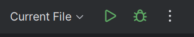
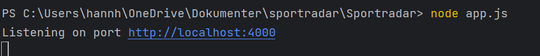

# Sportradar
A calendar interface for sport events

## To Start the Application
Clone the project and change into the project directory.

```shell
npm init
```

```shell
npm install express
```

Now you can run the Application with the run button



.. or via the terminal with

```shell
node app.js 
```


After clicking the link you will see the calendar.


## Thoughts on the development 

I have never made a calendar before, so this project was a first for me. I started by making a static 
calendar because I thought it would be easier, considering that I only should display the month of november.
During the development was I realising that it was only more difficult and wasn't practical, so I decided to take the dynamic approach. 
